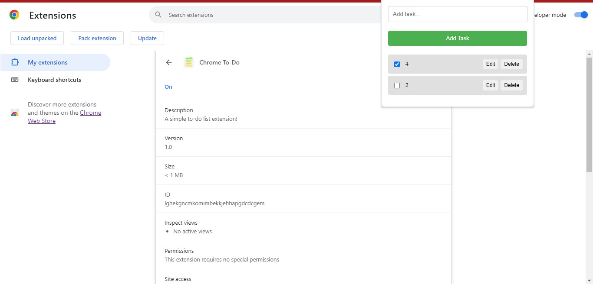

# Chrome To-Do Extension

A simple Chrome extension for managing your to-do list.

## Table of Contents
- [Introduction](#introduction)
- [Features](#features)
- [Screenshot](#Screenshot)
- [Installation](#installation)
- [Usage](#usage)
- [Contributing](#contributing)
- [License](#license)

## Introduction

This Chrome extension provides a straightforward to-do list manager with basic features like adding tasks, marking them as completed, editing tasks, and deleting tasks. It's a minimalistic approach to help you stay organized within your browser.

## Features

- Add tasks to the to-do list.
- Mark tasks as completed.
- Edit existing tasks.
- Delete tasks.
- Data persistence using Chrome's storage.

## Screenshot



## Installation

1. Clone the repository or download the ZIP file.
   ```bash
   git clone https://github.com/your-username/chrome-todo-extension.git

2. Open Google Chrome and navigate to chrome://extensions/.

3. Enable "Developer mode" in the top right corner.

4. Click on "Load unpacked" and select the directory where you cloned or extracted the extension files.

## Usage

1. Click on the extension icon in the Chrome toolbar.

2. The to-do list will appear. Add, edit, or delete tasks as needed.

3. Tasks are stored locally and persist even if you close the browser.

## Contributing

Contributions are welcome! If you find a bug or have an enhancement in mind, please open an issue or submit a pull request. Follow the Contributing Guidelines.

## License
This project is licensed under the MIT License.